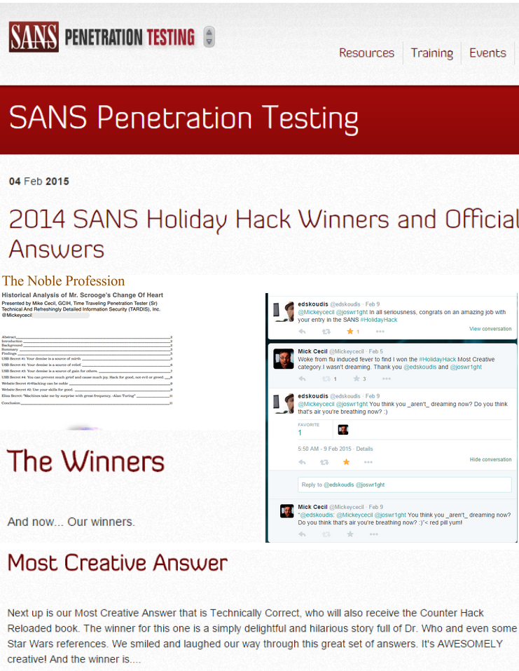

# Hi, I’m Mick,
 I am an experienced Security Engineer, Penetration Tester, and SecOps Leader with a passion for offensive security, vulnerability research, and building resilient security programs. With over 15 years in information security and extensive experience in penetration testing, threat operations, and incident response, I specialize in breaking systems to make them stronger.

My journey in security has taken me through leading security engineering teams, designing and executing large-scale penetration tests, and driving strategic security initiatives for Amazon's retail security team. I also have technical security and leadership experience in healthcare and hospitatlity markets. I thrive on discovering security flaws, developing exploit techniques, and working with teams to secure applications, networks, and cloud environments.

Beyond security testing, I have a  background in security automation, incident response, and insider threat detection, and I hold multiple certifications and patents in the field. I’ve also competed in and won large capture-the-flag (CTF) competitions, including winning the most creative, technical category in the SANS Holiday Hack Challenge, where I applied advanced offensive security techniques to real-world security problems.

This site serves as my digital space to share my projects, resume, and research. Whether it’s offensive security, hardware hacking, exploit development, or security automation, I enjoy diving into technical challenges that push security boundaries.

💡 Current Focus:\
🔹 Penetration Testing & Red Teaming\
🔹 Web & Application Security\
🔹 Reverse Engineering & Exploit Development\
🔹 Hardware Security & Embedded Systems\
🔹 Security Research & Threat Hunting

<iframe width="100%" height="166" scrolling="no" frameborder="no" allow="autoplay" src="https://w.soundcloud.com/player/?url=https%3A//api.soundcloud.com/tracks/2048028796&color=%23ff5500&auto_play=false&hide_related=false&show_comments=true&show_user=true&show_reposts=false&show_teaser=true"></iframe>
<a href="https://soundcloud.com/the-m1ck" title="The.m1ck" target="_blank" style="color: #cccccc; text-decoration: none;">The.m1ck</a> · <a href="https://soundcloud.com/the-m1ck/mickaudioresume" title="mickaudioresume" target="_blank" style="color: #cccccc; text-decoration: none;">mickaudioresume</a>

If you're interested in collaborating, discussing security topics, or just geeking out over offensive security, hardware hacking, security leadership, or breaking things in general (ethically, of course!), feel free to connect with me!

📄 Interested in my professional experience? Check out my [resume]

🚀 Let’s build and break security together!

📧 Email me - the.m1ck(at)proton.me

